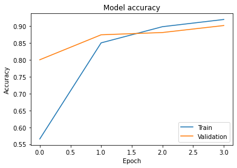

# emotion-detection-through-text
This model focuses on emotion detection from textual data but expands from the identification of positive and negative sentiments to identification of a spectrum of emotions from text. The ability to identify specific emotions from textual data can be helpful, most especially, for social media data analysis and prediction. It can also help to improve algorithms that make use of emotion detection to make predictions (e.g., Grammarly’s tone identification for text improvement predictions).

# Problem Definition
Human beings are able to exhibit a variety of emotions in many forms: through facial expressions, speech, text, or even body language. Machine learning algorithms of the current age of technology are very good at classifying these emotions, even with slight nuances in the difference between emotions like sadness and anger or fear and worry. Emotion detection through facial expressions is highly invested in and the best of current models are able to differentiate between even the most similar expressions with very high accuracy. 

There have also been many models that aim to perform sentiment analysis on textual data. Most of the research in this area is involved in the classification of positive and negative sentiments from text like reviews and comments, which are helpful for product analysis. In this paper, I focus on emotion detection from textual data, but expand from the identification of positive and negative sentiments, to identification of a spectrum of emotions from text. The ability to identify specific emotions from textual data can be helpful, most especially, for social media data analysis and prediction. It can also help to improve algorithms that make use of emotion detection to make predictions (e.g. Grammarly's tone identification for text improvement predictions). 

To make this model, I will compare and contrast the efficiency of models based on different machine learning algorithms using different metrics, and provide conclusions on the best performing model, as well as potential improvements to the model to increase classification accuracy.

# Pre-processing
The data I use for this model is prepared by Kaggle user [ishantjuyal](https://www.kaggle.com/ishantjuyal) (https://www.kaggle.com/datasets/ishantjuyal/emotions-in-text). It contains over 21,000 texts classified into 6 emotion classes: "happy" (renamed to "happiness" for consistency), "sadness", "anger", "love", "fear", and "surprise". 

I performed a number of preprocessing techniques on the data to convert it into a suitable format for the models to work with. First I cleaned the text data by removing stop words (short words that are not extremely relevant for the classification purposes), emails, hashtags and user tags, and punctation. After getting the final raw word data, I lemmatized the text data. This converts derivationally related words and to their base forms, thus making them easier to compare across different texts. For example, the lemmatization process converts both "crying" and "cried" to the base form "cry", so that they are categorized together when executing the model. Finally, I tokenized the text data, thus converting it into numerical format based on the individual words in the processed text. The text data has to be converted to a numerical format because the ML algorithms function only with mathematical operations on numerical data. 

# Solution Specification
I implemented a number of models for comparison. 

The first section of models are regular classification models. I used a Support Vector Classifier with an RBF kernel for classification, and then I tried transforming the input data further using dimensionality reduction (through PCA and LDA) and then applying the SVC. Finally, I implemented a Random Forest classifier on the data and computed the metrics. The Random Forest Classifier builds a number of decision trees on the data using different samples of the data, and then predicts the class of the testing data by pooling the classifications of these different decision trees. This was a new concept, so I believed it would be interesting to also explore this and compare its efficiency with the other methods I would implement. 

In the second section, I implement a neural network architecture to fit the model. In this network model, I make use of a new neural network layer: an LSTM. An LSTM, which stands for "Long short-term memory", is a neural network architecture used very largely in natural language processing. This is because LSTM's are designed to consider long-term relationships between words in language data. This allows the model to save and "remember" contextual information and dependencies across words in very long sentences, hence its name. I believe that such an architecture will prove helpful for emotion detection in text data, as some long sentences could contain contextual information about beared emotions in earlier parts of the sentences. 

# Testing and Analysis
After implementing the algorithms for each of the models, I compared the models by looking at their model accuracies and precisions from the classification. The results obtained from the model implementations showed that the neural network model performed better at classifying the data than the other less advanced models.

In the first section, the basic models performed quite poorly; the model that performed the best of them was the random forest classifier with an accuracy of 35% on the testing data. The models failed to identify many of the classes in the testing data, and classified almost all of the samples as eiter 2 ("love") or 4 ("fear"). This could be a result of the larger number of classes each model has to classify the data into (the models would probably perform better if it were postiive-negative sentiment analysis). It could also be a result of the format in which the data was preproccessed into, which might not be one suitable for the models to make inferences or identify distringuishing features for the classes. 

In the second section, the neural network model performed way better. The network had 5 layers: an embedding layer for transforming the data, the LSTM layer which does most of the classification, and 3 dense layers with different activation functions to return the model's class prediction. I fitting the model with a maximum of 10 epochs, and stopped fitting when the testing accuracy was larger than 90%.

The model was able to correctly classify the data with a bit over 90% accuracy, which is still quite impressive given the relatively small number of neural networks used. I generated a confusion matrix of the models predictions, and it was able to get most of the predictions right. It was also interesting to see how some of the false predictions the model made were between emotions that were also arguably similar. For example, the model misclassified "love" as "happiness" or ""fear" and "anger", a number of times, which suggests that the model is still, to some capacity, able to identify similarities between positive and negative emotions.

# Conclusion and Future Directions
The neural network model was the most successful model in detecting the emotions in the text data. The other algorithms might have performed poorly because of the input format of the data, or even because the parameters where not appropriately fine-tuned. Moreover, such models could perform better when combined with other algorithms and techniques. 

While the neural network model performed fairly well, it could still be improved by the refining of the current layers or the addition of more layers to the network. One possible improvement would be to use a Bi-directional LSTM (BiLSTM), which is better than a standard LSTM because it considers contextual information in long sequences both directions of flow along the text (forward and backward). Although limits to computational power have prevented me from implementing this, a study on the use of deep neural networks for detection of emotions through text made use of these BiLSTM's (Muhammad A., 2022), and the results seem to be valuable.

Finally, the algorithm could be expanded to include an even wider spectrum of emotions with more subtle nuances between them, like embarrassment, shyness, or even neutrality. Of course, with more classes for prediction, the model would have to be more detailed in extracting features from the text, and thus the layers of the neural network model, if used, would need to be better structured and fine-tuned. 

# References
- Muhammad Zubair Asghar, Adidah Lajis, Muhammad Mansoor Alam, Mohd Khairil Rahmat, Haidawati Mohamad Nasir, Hussain Ahmad, Mabrook S. Al-Rakhami, Atif Al-Amri, Fahad R. Albogamy, "A Deep Neural Network Model for the Detection and Classification of Emotions from Textual Content", Complexity, vol. 2022, Article ID 8221121, 12 pages, 2022. https://doi.org/10.1155/2022/8221121
- Ishant, J. (2021). Emotions in text. https://www.kaggle.com/datasets/ishantjuyal/emotions-in-text
- Fernanda, P. (2021). Emotion_Classification_using_LSTM. https://www.kaggle.com/code/fernandapratama/emotion-classification-using-lstm
- Rizki, R. (2021). Emotion in text Classification with LSTM. https://www.kaggle.com/code/rizkiprof/emotion-in-text-classification-with-lstm
- Prabhakaran, S. (2018, October 2). Lemmatization Approaches with Examples in Python. Machine Learning Plus. Retrieved April 22, 2022, from https://www.machinelearningplus.com/nlp/lemmatization-examples-python/

